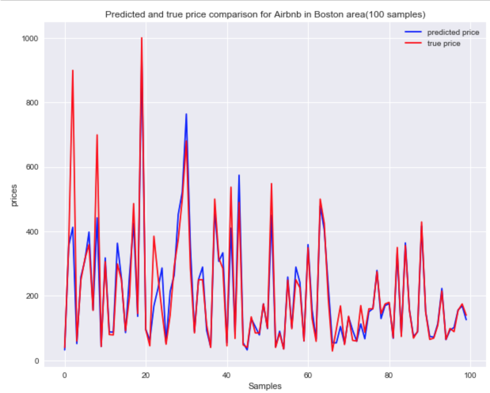
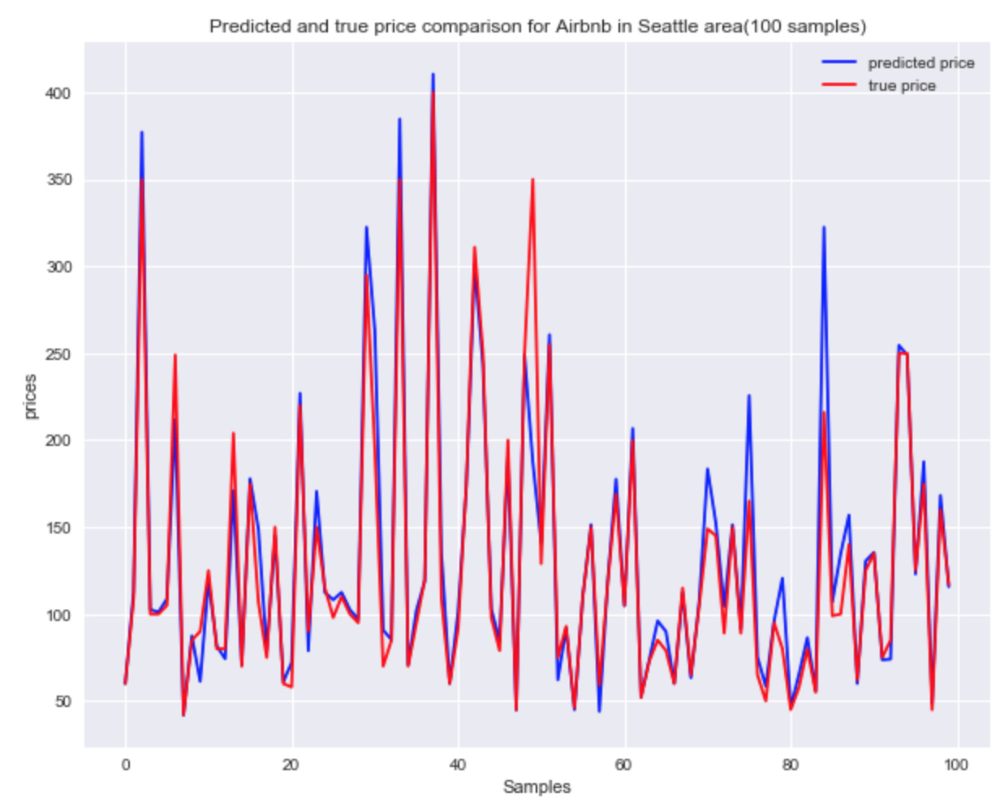
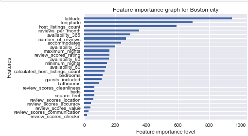
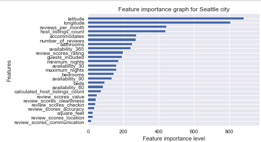

# Airbnb_Analysis

Use Airbnb Inside dataset from Boston and Seattle area to do renting price prediction.

# Motivation
This project aims to answer three questions:
- Is there any difference in average price between Boston and Seattle area?
- Can we predict price in Boston and Seattle Airbnb using this dataset?
- What are the top important features when predicting the price in two cities?

# Result:

## Renting price prediction
 

 

## Top important features

 

 

# Useful links
* [Blog](https://medium.com/@lihaoyu001/airbnb-data-insight-for-boston-and-seattle-area-4f73ab8981d8) - A blog to introduce this analysis.
